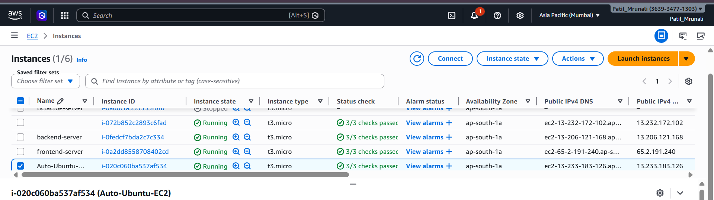
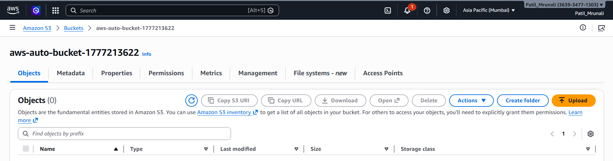
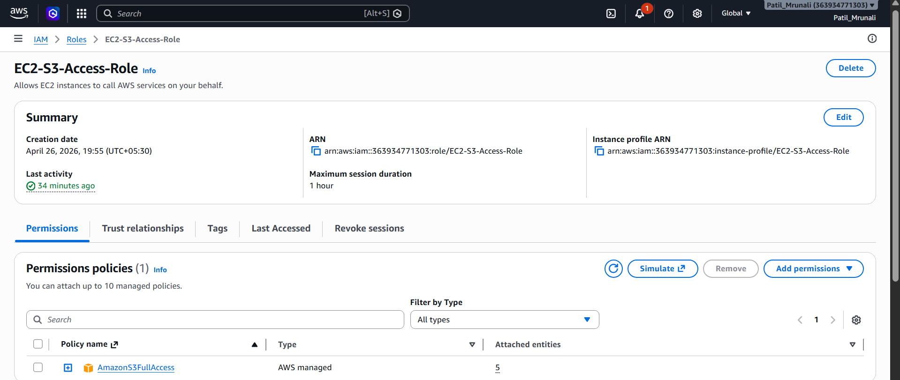
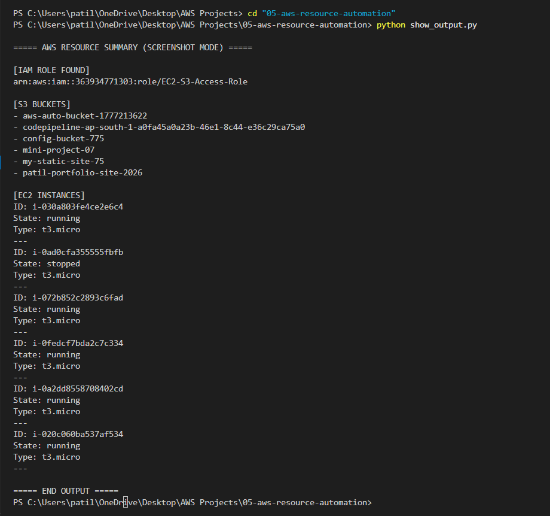

#  AWS Resource Provisioning Automation (EC2 + S3 + IAM using Boto3)

##  Project Overview

This project demonstrates automated AWS infrastructure provisioning using Python (Boto3). Instead of manually creating resources from the AWS Console, this script provisions AWS services programmatically.

It automates the creation and management of:
- IAM Role (reused)
- S3 Bucket
- EC2 Instance (Ubuntu t3.micro)
- IAM Role attachment to EC2

This project simulates real-world Infrastructure as Code (IaC) used in DevOps environments.

---

##  Objectives

* Automate AWS infrastructure using Python (Boto3)
* Eliminate manual AWS console operations
* Reuse IAM roles instead of recreating them
* Deploy EC2 instance with Ubuntu OS
* Attach IAM role to EC2 for AWS access
* Understand real-world cloud automation workflow

---

##  AWS Services Used

* Amazon EC2 (Ubuntu t3.micro instance)
* Amazon S3 (Storage bucket)
* AWS IAM (Role management & permissions)
* AWS SSM Parameter Store (Dynamic AMI retrieval)

---

##  Architecture

### 🔹 Architecture Flow

Python Script (Boto3)
│
▼
AWS IAM (Role Reuse)
│
▼
Amazon S3 (Bucket Creation)
│
▼
Amazon EC2 (Ubuntu Instance)
│
▼
IAM Role Attached to EC2

---

##  Workflow Explanation

* Python script starts execution
* IAM role is checked and reused
* S3 bucket is created dynamically
* Latest Ubuntu AMI is fetched using SSM
* EC2 instance (t3.micro) is launched
* IAM role is attached to EC2 instance
* Final output displays all created resources

---

##  Components

### 🔹 IAM Role (Reused)
* Role Name: EC2-S3-Access-Role
* Policy: AmazonS3FullAccess
* Used for EC2 → S3 access

---

### 🔹 Amazon S3 Bucket
* Created dynamically using timestamp
* Used for storage demonstration

Example:
aws-auto-bucket-xxxxxx

---

### 🔹 Amazon EC2 Instance
* Instance Type: t3.micro
* OS: Ubuntu (latest via SSM)
* Region: ap-south-1 (Mumbai)

---

### 🔹 AWS SSM Parameter Store
* Used to fetch latest Ubuntu AMI dynamically
* Removes dependency on hardcoded AMI IDs

---

##  Implementation Steps

### 🔹 Step 1: IAM Role Setup

* Create IAM Role in AWS Console
* Trusted entity: EC2
* Attach policy: AmazonS3FullAccess
* Role Name: EC2-S3-Access-Role

---

### 🔹 Step 2: AWS CLI Configuration

bash
aws configure

- Enter:

Access Key
Secret Key
Region: ap-south-1
Output: json

---

### 🔹 Step 3: Run Script
python main.py

---

### 🔹 Step 4: Execution Flow

IAM role is reused
S3 bucket is created
Ubuntu AMI is fetched
EC2 instance is launched
IAM role is attached
Final output is displayed

---

### 🔹 Output Example

===== AWS RESOURCE PROVISIONING STARTED =====

[INFO] IAM Role reused successfully
[INFO] Creating S3 bucket...
[SUCCESS] S3 Bucket created: aws-auto-bucket-xxxx

[INFO] Launching EC2 instance...
[INFO] Fetching latest Ubuntu AMI...
[SUCCESS] EC2 Launched: i-xxxxxxxxxxxx
[INFO] EC2 is running

[INFO] Attaching IAM Role...
[SUCCESS] IAM Role attached

---

### ===== FINAL OUTPUT =====

IAM Role  : arn:aws:iam::xxxx:role/EC2-S3-Access-Role
S3 Bucket : aws-auto-bucket-xxxx
EC2 ID    : i-xxxxxxxxxxxx

---

### 🔹 Screenshots

🔹 EC2 Instance

🔹 S3 Bucket

🔹 IAM Role

🔹 Terminal Output

---

### 🔹 Challenges Faced
IAM role not found initially
AMI selection issues in different regions
EC2 launch errors due to key pair mismatch
AWS permission configuration issues

---

### 🔹 Solutions Implemented
Added IAM role reuse logic
Used AWS SSM for dynamic AMI retrieval
Verified key pair before EC2 launch
Ensured correct IAM permissions for S3 access

---

### 🔹 Key Learnings
AWS automation using Boto3
EC2 provisioning using Ubuntu AMI
IAM role reuse strategy
S3 bucket automation
AWS SSM Parameter Store usage
Real-world DevOps workflow understanding

---

### 🔹 Future Improvements
Add automatic EC2 termination (cost optimization)
Add logging system instead of print statements
Use environment variables for credentials
Convert to Terraform (Infrastructure as Code)
Add CI/CD pipeline using GitHub Actions

---

### 🔹Author
Mrunali Patil
